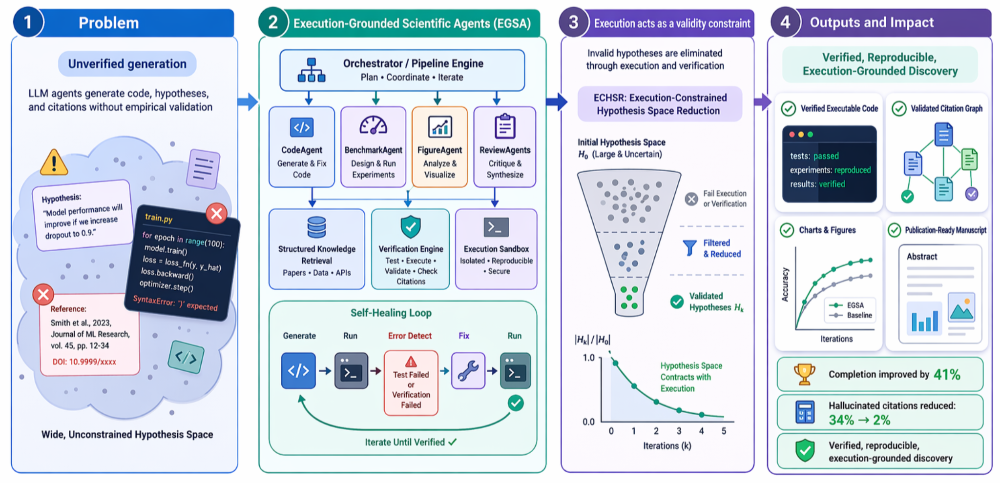
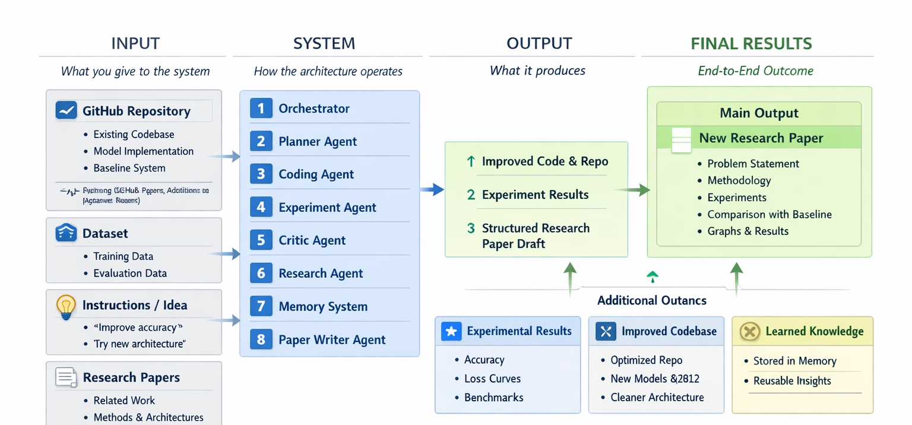
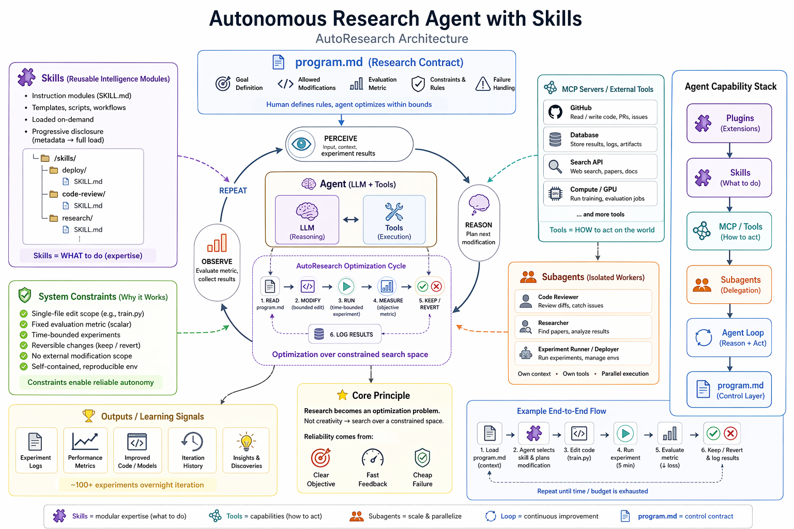
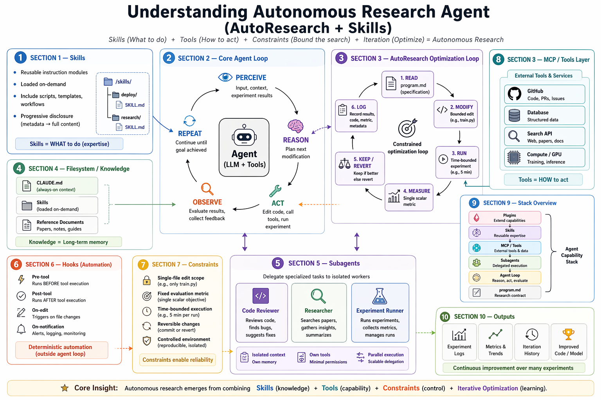
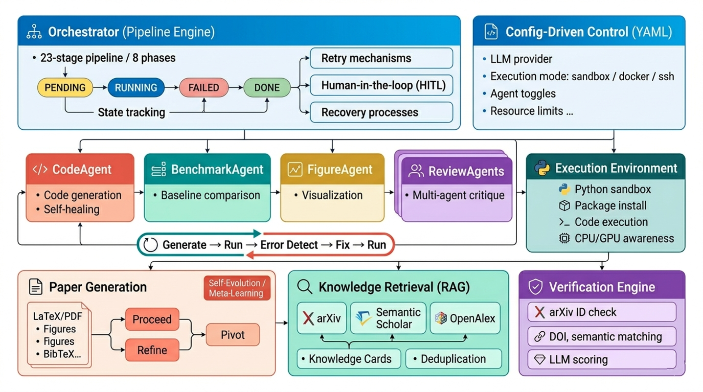

# 🧠 AutoResearch

**AutoResearch: An Execution-Grounded Multi-Agent Framework for AI Paper and Code Generation**

AutoResearch is a unified multi-agent framework that takes **code, data, ideas, and papers** as input, runs an execution-grounded research loop, and produces **improved code, validated experiment results, and a structured research paper**.

> In short: **Input → Think + Experiment + Learn → New Code + Better Results + Research Paper**

---

## Overview

AutoResearch is designed around a simple principle: generated research artifacts should be constrained by **execution**, **verification**, and **iteration**, not only by text generation.

The framework combines:
- **planning and orchestration** for multi-stage task control,
- **code generation and self-healing** for iterative experiment repair,
- **retrieval and verification** for grounded citations and supporting evidence,
- **paper writing and review** for structured manuscript generation,
- **memory and meta-learning** for cross-run improvement.

---
# AutoResearch

🎥 Demo Video: [Watch on YouTube](https://youtu.be/0NrF5dtS3KI)


## Visual Overview

### Graphical Abstract



### Core Architecture



### System Architecture



### Detailed Pipeline View



---

## Input → System → Output

### Input
AutoResearch is built to work with mixed research materials, including:
- **GitHub repositories** and existing codebases
- **datasets** for training and evaluation
- **instructions / ideas** such as “improve accuracy” or “try a new architecture”
- **research papers** for related work, baselines, and methods
- **documents** such as PDFs, DOCX files, notes, and logs

### System
The architecture operates through a coordinated multi-agent loop:
- **Orchestrator** controls the execution pipeline and stage transitions
- **Planner / Query Engine** parses tasks and decomposes objectives
- **CodeAgent / Coding Agent** generates and repairs code
- **Experiment / Benchmark Agent** runs experiments and compares against baselines
- **FigureAgent** generates charts and visual summaries
- **Review Agents / Critic Agent** critique outputs and refine results
- **Research Agent** retrieves literature and structured evidence
- **Verification Engine** checks references, evidence alignment, and citation validity
- **Memory System / Meta-Learning** stores reusable lessons and failure-derived skills
- **Paper Writer Agent** generates the final structured manuscript

### Output
The framework produces:
- **improved code and repository updates**
- **experiment results**, metrics, plots, and benchmark comparisons
- **structured research paper drafts**
- **publication assets** such as figures, tables, and BibTeX references
- **reusable learned knowledge** stored for future runs

---

## Key Design Ideas

### 1. Execution-Grounded Loop
At the center of AutoResearch is a self-healing loop:

**Generate → Run → Error Detect → Fix → Run**

Instead of treating code generation as a one-shot activity, the framework uses execution feedback as a first-class signal for correction and refinement.

### 2. Multi-Agent Coordination
AutoResearch distributes responsibilities across specialized agents rather than forcing one model to do everything. This improves modularity, transparency, and controllability.

### 3. Retrieval + Verification
The framework combines structured retrieval with citation verification to reduce unsupported references and weak literature grounding.

### 4. Paper Generation from Executed Results
The paper-writing pipeline is grounded in executed experiments, benchmark outputs, and verified references, allowing the system to produce a structured manuscript rather than an ungrounded draft.

---

## Pipeline Summary

A typical run looks like this:

```text
Input: code + data + idea + papers
  ↓
Orchestrator / Query Engine parses the task
  ↓
Planner creates an execution strategy
  ↓
CodeAgent generates or edits code
  ↓
Execution sandbox runs the code
  ↓
If failure: detect error → repair → re-run
  ↓
Benchmark / Experiment agents evaluate results
  ↓
Retrieval + verification ground claims and citations
  ↓
Paper Writer assembles the research artifact
  ↓
Output: improved code + better results + research paper
```

---

## Repository Structure

```text
AutoResearch/
├── main.py              ← app + routes + entry point
├── orchestrator.py      ← pipeline engine and stage control
├── llm.py               ← model provider abstraction
│
├── agents/
│   ├── engineering.py   ← planner, coder, tester, debugger, critic
│   ├── research.py      ← researcher, experiment, paper writer
│   ├── conception.py    ← ideation and concept shaping agents
│   ├── paper.py         ← outline, section, citation, figure, reviewer
│   ├── experiment.py    ← planning, codegen, runner, tracker, evaluator
│   ├── decision.py      ← proceed / refine / pivot control
│   ├── memory.py        ← cross-run knowledge and state reuse
│   ├── gan.py           ← adversarial generate-evaluate loop
│   ├── hooks.py         ← session lifecycle events
│   ├── context_modes.py ← dev / research / review switching
│   └── registry.py      ← unified agent registry
│
├── tools/               ← sandbox, file reader, executor, output manager
├── skills/              ← knowledge files and workflow skills
├── research/            ← retrieval, pipeline, templates, HITL, assessor
├── static/              ← web GUI
├── tests/
└── eval/
```

---

## Quick Start

```bash
bash deploy.sh
source .venv/bin/activate
python main.py
```

Then open:

```text
http://localhost:8000
```

---

## Example Workflow

```text
Input:
  GitHub repo + dataset + idea + related papers

System:
  Think + experiment + learn

Output:
  New code + better results + research paper
```

---

## API

| Endpoint | What it does |
|----------|-------------|
| `POST /api/agent/run` | Run a task synchronously |
| `POST /api/agent/stream` | Run with SSE streaming |
| `POST /api/upload` | Upload PDF / DOCX / CSV / JSON assets |
| `POST /api/conception/ideate` | Run the ideation pipeline |
| `POST /api/experiment/run` | Run the experiment pipeline |
| `POST /api/paper/write` | Run the paper-generation pipeline |
| `POST /api/gan/run` | Run the adversarial generate-evaluate loop |
| `GET /api/skills/agents` | List available skill agents |
| `GET /api/skills/rules/{lang}` | Return language-specific rules |
| `GET /api/outputs` | Browse saved outputs |

---

## Why AutoResearch?

AutoResearch is intended for workflows where a user wants more than code generation alone. It is built for end-to-end research automation scenarios such as:
- improving an existing repository,
- testing new ideas against baselines,
- generating figures and experiment summaries,
- grounding claims in retrieved literature,
- drafting a research manuscript from executed results.

---

## Citation

If you use this project, please cite:

```bibtex
@misc{kumar2026autoresearch,
  title={AutoResearch: An Execution-Grounded Multi-Agent Framework for AI Paper and Code Generation},
  author={Rajesh Kumar and Waqar Ali and Junaid Ahmed and Abdullah Aman Khan and Shaoning Zeng and Yong Tang},
  year={2026},
  note={arXiv preprint, update identifier when public}
}
```

---

## Notes

- The diagrams in `assets/images/` summarize the architecture, execution loop, and output flow.
- The framework is designed around **execution-grounded validation**, not text-only generation.
- Retrieval, verification, and paper generation are treated as first-class components of the system.
